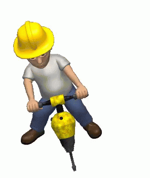

Site under construction!

# About
I'm a fourth-year PhD candidate in the LIGO Lab at MIT. 
I was previously an undergrad at Carleton College.
I'm interested in gravitational waves, multi-messenger astronomy, and how we can use both gravity and light to learn about the universe.

# Research

## Multi-messenger astrophysics
- TESS: searching for counterparts to gravitational waves in a telescope originally designed for exoplanets
- WINTER: simulations to determine the potential kilonova detection rate of a new 1-meter infrared telescope

## LIGO
- Low-latency infrastructure: gwcelery, userguide
- Detector characterization: safety studies, pointy-poisson

## Next-generation detectors
- How often will Cosmic Explorer and Einstein Telescope localize a binary black hole or black hole-neutron star merger to within the volume of a single galaxy?

# Teaching and mentoring
- TA for 8.021 E&M (Fall 2020, Fall 2022)
- Graduate student mentor for three undergraduate researchers (2020-2022)
- Undergraduate TA and lab assistant for E&M, Contemporary Physics Lab, and Intro to Astronomy (2017-2019)

# Service
- Admissions for the MIT Summer Research Program, targeted at recruiting underrepresented undergradutes to spend a summer conducting research at MIT (2021, 2022, 2023)
- Faculty search committee, MIT Astrophysics (2021)
- MIT Kavli Institute Anti-Racism Task Force (2020)
- Various roles at Carleton, including serving on the Departmental Curriculum Committee and being a Student Departmental Advisor
